#  電気概論 第1回(10/11)

## 第2部 直流回路

### 第1章 オームの法則

電圧と電流

電気的な位置の高さを**電位**といい，電池の**陽極**(+極)の電位は**陰極**(-極)の電位よりも高い．電気の流れを**電流**といい，電流は電池の両極間の電位に差があるときに流れる．この電位の差を**電位差**または，**電圧**という．電位差を保って連続的に電流aaを流す原動力となるものを**起電力**という．この起電力を発生して電気エネルギーを供給する装置を**電源**という．電流が流れて電気を消費する働きをするものを**負荷**という．電流が流れる通路を**電気回路**または**回路**という．電流が実際に回路に流れている場合，回路が閉じている，あるいは**閉回路**であるという．これに対して，実際に電流が流れていない場合，回路が開いている，あるいは**開回路**であるという．

#### オームの法則

閉回路に電圧を印加すると電流が流れるが，この電気回路に流れる電流は電圧に比例し，回路の抵抗に反比例する．これを**オームの法則**という．オームの法則を数式で表すと以下のようになる．電圧をV，抵抗をR，電流をIと置くと，
$$
V = RI
$$
と表せる．

# 電気概論 第2回(10/18)

## オームの法則を用いた問題

1. 問題1

   1. 抵抗Rが50Ωとすると，この抵抗に3Aの電流を流すめには何Vの電圧を加えれば良いか
      $$
      \begin{align}
      V & = RI \\
      & = 50 \times 3 \\
      & = \underline{ \underline{ 150 V } }
      \end{align}
      $$

   2. 電圧が12V，流れる電流Iが2Aとすると，この回路の抵抗値を求めよ
      $$
      \begin{align}
      R & = V / I \\
      & = 12 / 2 \\
      & = \underline{ \underline{ 6 \Omega } }
      \end{align}
      $$

   3. 20Ωの抵抗に100Vの電圧を加えると，流れる電流Iはいくらか
      $$
      \begin{align}
      I & = V / R \\
      & = 100 / 20 \\
      & = \underline{ \underline { 5 A } }
      \end{align}
      $$

## 補助単位

回路や情報処理の世界では，扱うデータの大きさが，非常に大きな値から，非常に小さな値を扱う．そこで，補助単位を用いることで，わかりやすい値となる．

<table>
  <tr>
    <th>単位</th>
    <td>p</td>
    <td>n</td>
    <td>µ</td>
    <td>m</td>
    <td>k</td>
    <td>M</td>
    <td>G</td>
    <td>T</td>
    <td>P</td>
  </tr>
  <tr>
    <th>読み</th>
    <td>ピコ</td>
    <td>ナノ</td>
    <td>マイクロ</td>
    <td>ミリ</td>
    <td>キロ</td>
    <td>メガ</td>
    <td>ギガ</td>
    <td>テラ</td>
    <td>ペタ</td>
  </tr>
  <tr>
    <th>指数</th>
    <td>10-12</td>
    <td>10-9</td>
    <td>10-6</td>
    <td>10-3</td>
    <td>103</td>
    <td>106</td>
    <td>109</td>
    <td>1012</td>
    <td>1015</td>
  </tr>
</table>

1. 次の単位を指定した単位で表しなさい

   1. 0.003V = 3 mV = 3000 µV
   2. 470000 Ω = 470 kΩ = 0.47 MΩ
   3. 10A = 10000 mA = 0.01 kA

2. 抵抗Rが4kΩで，これに100Vの電圧を加えた時，流れる電流の値を求めよ
   $$
   \begin{align}
   I & = V / R \\
   & = 100 / \left( 4 \times 10^{3} \right) \\
   & = 0.025 \\
   & = \underline{ \underline{ 25 mA } }
   \end{align}
   $$

3. 回路の電圧が12Vで，流れる電流が3mAの時，この回路の抵抗値を求めよ
   $$
   \begin{align}
   R & = V / I \\
   & = 12 / \left( 3 \times 10^{-3} \right) \\
   & = 4000 \\
   & = \underline{ \underline{ 4k \Omega } }
   \end{align}
   $$

# 電気概論 第3回(10/25)

## 第2部 直流回路

### 第4章 抵抗の直列接続と並列接続

#### 抵抗の直列接続

2つの抵抗を下図のように接続した回路を直列接続という．

抵抗を2つ以上接続した時の全体の抵抗を**合成抵抗**という．合成抵抗をR0とすると，合成抵抗R0はR1+R2となる．

また，各抵抗の両端に発生する電圧を**電圧降下**という．
$$
\begin{align}
V_1 & = R_1 I \\
V_2 & = R_2 I \\
V & = V_1 + V_2 \\
I & = V / R_0 \\
\end{align}
$$

1. 次の回路の計算をせよ

   

   

   1. 合成抵抗R0を求めよ
      $$
      \begin{align}
      R_0 & = R_1 + R_2 \\
      & = 10 + 40 \\
      & = \underline{ \underline{ 50 \Omega } }
      \end{align}
      $$

   2. 回路に流れる電流Iを求めよ
      $$
      \begin{align}
      I & = V / R_0 \\
      & = 100 / 50 \\
      & = \underline{ \underline{ 2 A } }
      \end{align}
      $$

   3. 10Ωの電圧降下と40Ωの電圧降下をそれぞれ求めよ
      $$
      \begin{align}
      V_1 & = V_0 \times R_1 / R_0 \\
      & = 100 \times 10 / 50 \\
      & = \underline{ \underline{ 20 V } } \\
      V_2 & = V_0 \times R_2 / R_0 \\
      & = 100 \times 40 / 50 \\
      & = \underline{ \underline{ 80 V } } \\
      \end{align}
      $$

2. 次の回路の計算をせよ

   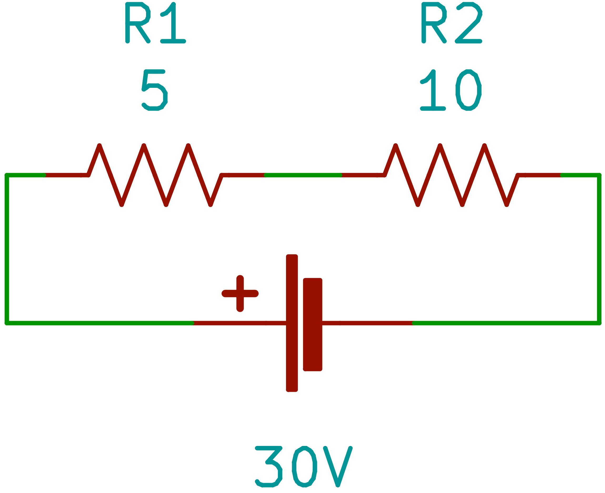

   1. 合成抵抗R0を求めよ
      $$
      \begin{align}
      R_0 & = R_1 + R_2 \\
      & = 5 + 10 \\
      & = \underline{ \underline{ 15 \Omega } }
      \end{align}
      $$

   2. 回路に流れる電流Iを求めよ
      $$
      \begin{align}
      I & = V / R_0 \\
      & = 30 / 15 \\
      & = \underline{ \underline{ 2 A } }
      \end{align}
      $$

   3. 5Ωの電圧降下と10Ωの電圧降下をそれぞれ求めよ
      $$
      \begin{align}
      V_1 & = V_0 \times R_1 / R_0 \\
      & = 30 \times 5 / 15 \\
      & = \underline{ \underline{ 10 V } } \\
      V_2 & = V_0 \times R_2 / R_0 \\
      & = 30 \times 10 / 15 \\
      & = \underline{ \underline{ 20 V } } \\
      \end{align}
      $$

直列接続の合成抵抗は，抵抗値の総和となる．

# 電気概論 第4回(11/08)

## 抵抗の並列接続2

3個の抵抗が並列に接続された回路．

問題1. 以下の回路の合成抵抗R0と各抵抗に流れる電流I1，I2，I3と全電流

Iの値をそれぞれ求めよ

$$
\begin{align}
I_1 & = V / R_1 \\
& = 24 / 6 \\
& = \underline{ \underline{ 4 A } } \\
I_2 & = V / R_2 \\
& = 24 / 4 \\
& = \underline{ \underline{ 6 A } } \\
I_3 & = V / R_3 \\
& = 24 / 12 \\
& = \underline{ \underline{ 2 A } } \\
I & = I_1 + I_2 + I_3 \\
& = 4 + 6 + 2 \\
& =　\underline{ \underline{ 12 A } } \\
R_0 & = V / I \\
& = 24 / 12 \\
& =\underline{ \underline{ 2 \Omega } } \\
\end{align}
$$
問題2. 以下の回路の合成抵抗R0と各抵抗に流れる電流と全電流Iを求めよ

同じ抵抗がn個並列に接続された場合の合成抵抗R0はR0 = R / n となる．
$$
\begin{align}
R_0 & = 25 / 5 \\
& = \underline{ \underline{ 5 \Omega } }
\end{align}
$$
各抵抗に流れる電流は
$$
50 / 25 = \underline{ \underline{ 2A } }
$$
全電流は
$$
\begin{align}
I & = V / R_0 \\
& = 50 / 5 \\
& = \underline{ \underline{ 10 A } }
\end{align}
$$

## 抵抗の直並列回路

次の回路の合成抵抗を求めなさい

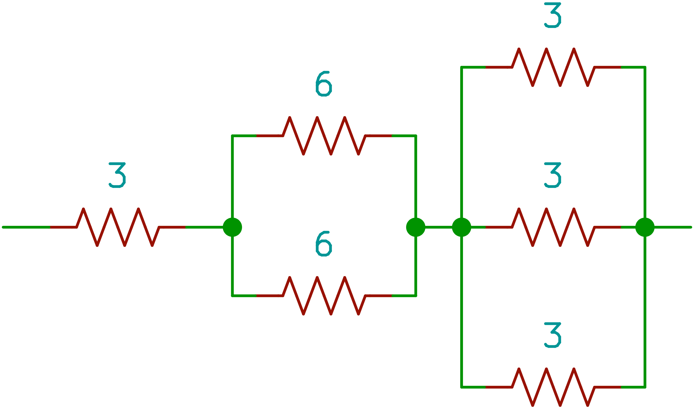

$$
R_0 = 3 + 3 + 1 = \underline{ \underline{ 7 \Omega } }
$$
次の合成抵抗を求めなさい

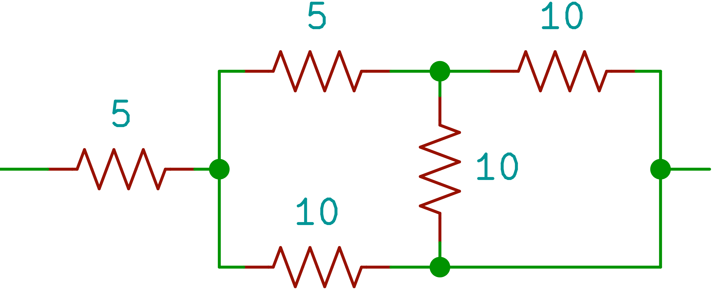

$$
R_0 = 5 + 5 = \underline{ \underline{ 10 \Omega } }
$$

# 電気概論 第5回(11/15)

## 抵抗の直並列回路

次の回路の合成抵抗を求めよ．

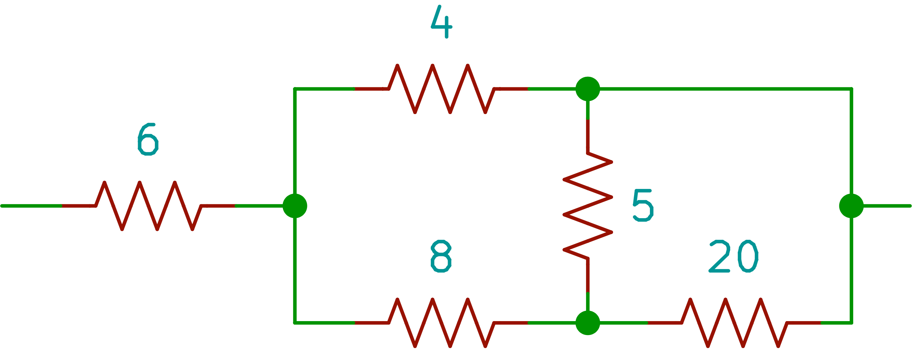

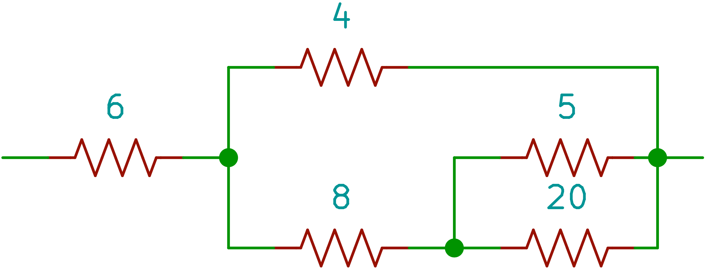

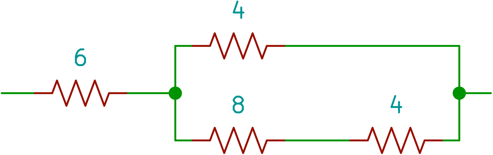

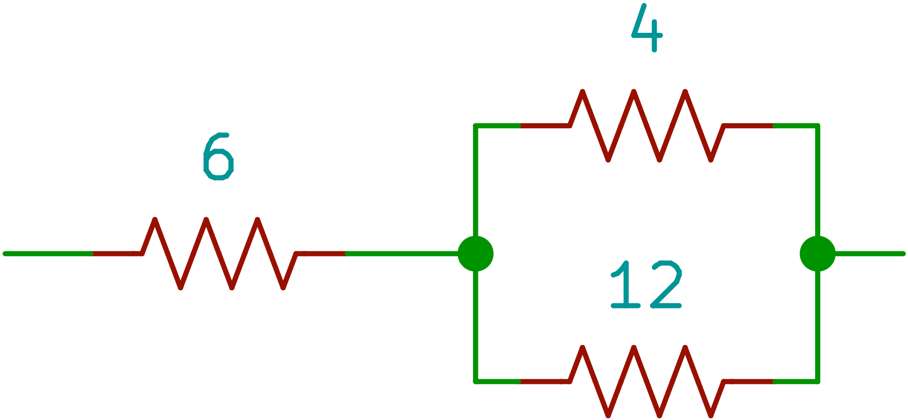
$$
\begin{align}
R_0 & = 6 + \left( 1 / 4 + 1 / 12 \right)^{-1} \\
& =  \underline{ \underline{ 9 \Omega } }
\end{align}
$$
問題1. 次の回路の合成抵抗を求めよ．

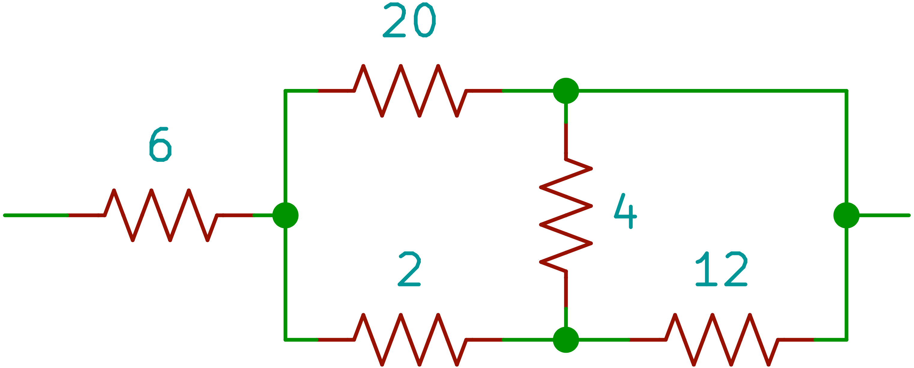

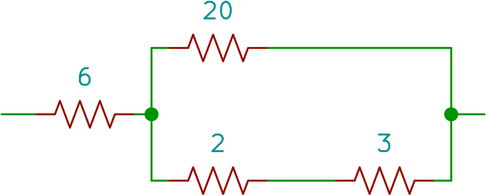

$$
\begin{align}
R_0 & = 6 + \left( 1 / 20 + 1 / 5 \right)^{-1} \\
& = \underline{ \underline{ 10 \Omega } }
\end{align}
$$

問題2. 次の回路の合成抵抗を求めよ．

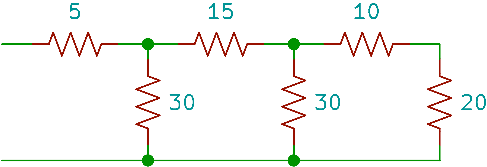

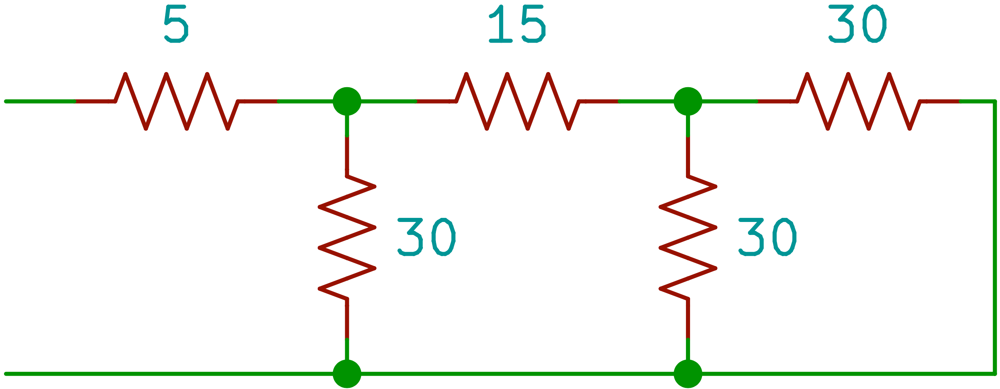

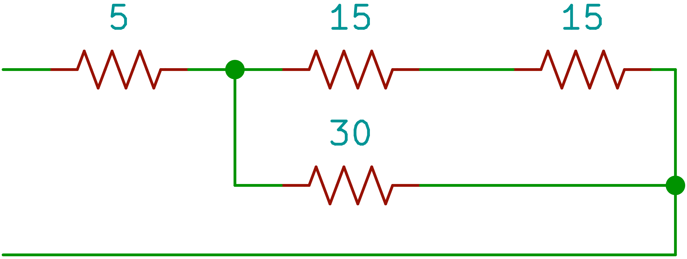

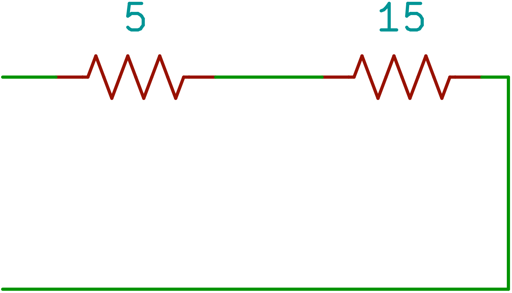
$$
R_0 = 5 + 15 = \underline{ \underline{ 20 \Omega } }
$$

問題3. 次の回路を流れる電流I1とI2の値，及びR3の値を求めよ．

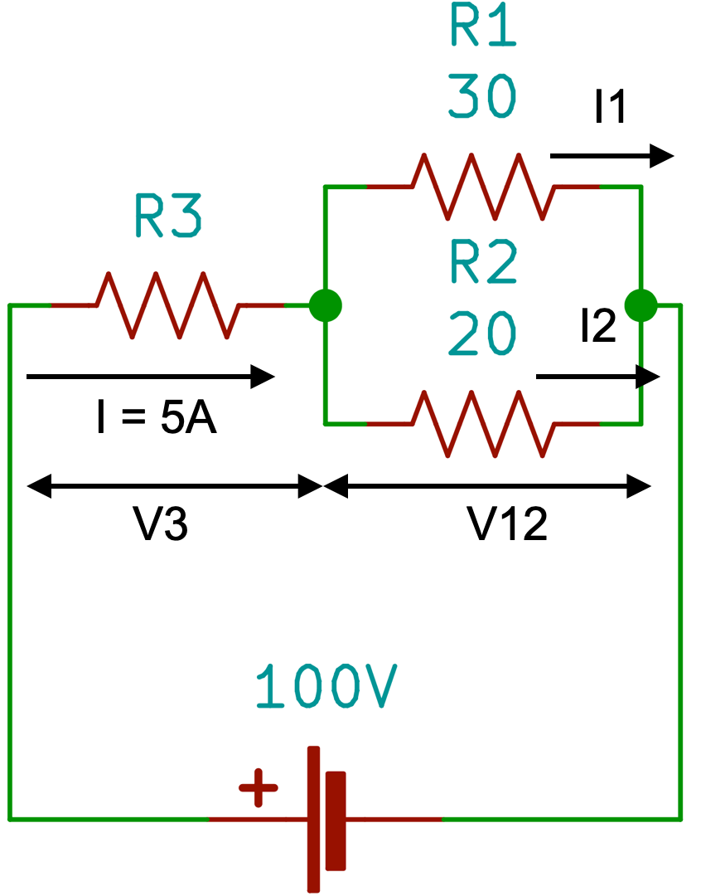

$$
\begin{align}
R_0 & = E / I = 100 / 5 \\
& = \underline{ \underline{ 20 \Omega } } \\
R_{12} & = \left( 1 / 30 + 1 / 20 \right)^{-1} \\
& = \underline{ \underline{ 12 \Omega } } \\
R_3 & = 20 - 12 \\
& = \underline{ \underline{ 8 \Omega } } \\
V_3 & = IR_3 \\
& = 5 \times 8 \\
& = \underline{ \underline{ 40 V } } \\
I_1 & = 60 / 30 \\
& = \underline{ \underline{ 2 A } } \\
I_2 & = 60 / 20 \\
& = \underline{ \underline{ 3 A } } \\
\end{align}
$$

# 電気概論 第6回(11/22)

### 電力

電気が単位時間に行う仕事の量を電力といい，量記号はP，単位はWを用いて表す．電力Pは回路に加えた電圧Vと流れる電流Iの積で求められる．

P = VI

回路の抵抗をR[Ω]とすると，V = RIより
$$
P = RI^2 = V^2 / R [ W ]
$$
問題1. 電熱器に100Vの電圧が加わり，5Aの電流が流れている場合，電熱器に消費される電力Pはいくらか
$$
P = VI = 500W
$$
問題2. 20Ωの抵抗に5Aの電流が流れている時，抵抗によって消費される電力を求めよ．
$$
\begin{align}
P & = VI = RI^2 \\
& = 20 \times 5^2 \\
& = \underline{ \underline{ 500 W } }
\end{align}
$$
問題3. 25Ωの抵抗に100Vの電圧を加えた時，抵抗で消費される電力Pを求めよ
$$
\begin{align}
P & = VI = V^2/R \\
& = 100^2 / 25 \\
& = \underline{ \underline{ 400 W } }
\end{align}
$$
電力の単位はWだが大きい値の場合にはkWやMWが用いられる．逆に小さい電力の場合はmWやµWを用いる．

問題4. 電熱器に100Vの電圧を印加し，20Aの電流を流すと，電熱器によって消費される電力はいくらか.

また電熱器の抵抗はいくらか．
$$
\begin{align}
P & = VI \\
& = 100 \times 20 \\
& = \underline{ \underline{ 2 kW } } \\
R & = V / I \\
& = 100 / 20 \\
& = \underline{ \underline{ 5 \Omega } }
\end{align}
$$

### 電力量

電気がある時間内に行った電気的な仕事の総量，つまり電気エネルギーの総量を電力量という．電力量の記号はW，単位はWsを用いる．W = Pt [ Ws ]

問題5. 40Wの電球を10秒間点灯すると電力量はいくらか
$$
W = 40 \times 10 = 400 Ws
$$
問題6. 500Wの電熱器を10時間使用した時の電力量を求めよ
$$
W = 500 \times 10 = \underline{ \underline{ 5kWh } }
$$

# 電気概論 第7回(11/29)

### ジュール熱

I[A]の電流がR[Ω]の中をt[s]流れると，RPt[Ws]の電気エネルギーすなわち電力量が消費され，その抵抗にRI2t[J]の熱が発生する．この作用を<u>電流の発熱作用</u>といい，発生する熱を<u>ジュール熱</u>という．電気エネルギーや熱エネルギーなど，エネルギーの量

または仕事量を表す単位にジュール[J]を用いる．1[J]は1[A]の電流が1[Ω]の抵抗中を1[s]間流れた時に行う仕事量に相当する．したがって，1[W]とは1[J/s]の仕事を行う電気の能力である．1[W]=1[J/s]または1[W]=1[Ws]である．

例）600[W]の電熱器は，1秒間に600[J]の仕事をしている．

### 熱量

熱エネルギーは一般に熱量と呼ばれ，単位に[cal]を用いる．1[J]の仕事量は約0.24[cal]の熱量に相当する．1[cal]の熱量とは，1[g]の水を1[℃]上昇させるのに必要な熱量である．R[Ω]の抵抗にI[A]の電流をt[s]流した時発生する熱量H[cal]は次のようになる
$$
H = 0.24W = 0.24 Pt = 0.24RI^2 t [ cal ]
$$

# 電気概論 第8回(12/06)

## 電熱機器の効率

一般に電熱機器は発生した熱量が全て目的の仕事に使われるとは限らない．電気ポットの場合，発生した熱量の一部がポット自身を温めたり空気中に発散したりする．従って，発生した熱量の一部は，無駄な熱量になる．

有効な熱量と発生した総熱量の比を器具の効率といい，ηで表す．
$$
\begin{align}
\eta & = \left( 発生総熱量 - 無効熱量 \right) / 発生総熱量 \times 100 \\
& = 有効熱量 / 発生総熱量 \times 100 [ \% ]
\end{align}
$$
問題1. 500Wの電熱器を30分使用した時何[kcal]の熱量を有効に使用できるか．電熱器の効率を50％とする．
$$
\begin{align}
H & = 0.24 \times 500 \times ( 30 * 60 ) \times 0.5 \\
& = 108000 \\
& \therefore \underline{ 108 [ kcal ] }
\end{align}
$$
問題2. 20℃の水0.5Lを300Wの電気ポットを使用して10分間加熱した．水の温度は何度か．電気ポットの効率を80％とする．
$$
0.24 \times 300 \times 600 \times 0.8 = 34560 [cal] \\
0.5 [ L ] = 500 [ g ] \\
34560 / 500 = 69.12 \\
20 + 69.12 = 89.12 [ ^\circ C ]
$$

### 第3章 抵抗の性質

物体の抵抗値は物体自身の固有な性質（材質）や物体の形状，さらに温度によって決まる．

同じ材料，同じ太さ（断面積）の導体では，長さが長くなるほど抵抗は増加する．また，同じ材料，同じ長さの導体では断面積が広いほど抵抗値は減少する．従って，導体の抵抗をR，長さをl，断面積をAとし，抵抗率をρとすると
$$
R = \rho l / A [\Omega]
$$
となる．

長さは[m]，断面積は[m2]となる．抵抗率ρは断面積1m2で長さ1mの抵抗値に等しい．

# 電気概論 第9回(12/20)

## 抵抗率の計算

$$
R = \rho \frac{l}{A}
$$

問題1. 軟銅の抵抗率ρ=1.7241x10-8 [Ωm]で断面積0.75mm2で長さ100mのとき抵抗の大きさを求めよ
$$
\begin{align}
    R &= \rho \frac{l}{A} \\
    &=1.7241\times 10^{-8} \times \frac{100}{0.75 \times 10^{-6}} \\
    &\approx 2.3 [ \Omega ]
  \end{align}
$$
問題2. 100V用の500Wの電熱器のニクロム線がある．ニクロム線の抵抗率ρ=100x10-8[Ωm]，ニクロム線の断面積A=0.2x10-6[m2]

1．電熱器の抵抗を求めよ
$$
\begin{align}
    P &= V^2 / R \\
    R &= V^2 / P \\
    &= 100^2 / 500 \\
    &= 20 [ \Omega ]
  \end{align}
$$

2．長さlを求めよ
$$
\begin{align}
    R &= \rho \frac{l}{A} \\
    \rho l &= AR \\
    l &= \frac{AR}{\rho} \\
    &= \frac{ ( 0.2 \times 10^{-6} ) \times 20 }{ 100 \times 10^{-8} } \\
    &= \frac{ 4 \times 10^{-6} }{ 100 \times 10^{-8} } \\
    &= 4 [m]
  \end{align}
$$
問題3．断面が円形の銅線の抵抗値は，銅線の長さを9倍にした時，直径を何倍にすれば抵抗値は変化しないか

断面積Aが大きいほど電流が流れやすくなるのでRは小さくなり，また，長さlが長いほどその分抵抗は増えるのでRは大きくなる．長さlを9倍にした時，抵抗Rが変わらないようにするためにには断面積Aを9倍にする必要がある．従って導体の直径は3倍にすれば良い．

問題4．A，B2本の同材質の銅線がある．Aは直径1.6mm，長さ200m，Bは直径3.2mm，長さ100mである．Aの抵抗はBの何倍になるか
$$
\begin{align}
  R_A &= \frac{200}{0.8^2 \pi} \\
  &= \frac{200}{0.64} \\
  &= 312.5 \\
  R_B &= \frac{100}{1.6^2} \\
  &= \frac{100}{2.56} \\
  &= 39.0625 \\
  & 312.5 / 39.0625 = 8倍
\end{align}
$$

# 電気概論 第10回(1/17)

## 抵抗の温度変化（P74)

一般に導体の抵抗と温度との関係は，ほぼ直線的に変化する．温度t℃の時の抵抗値をRtΩとし，温度が変化してT℃になった時の抵抗値をRTΩとすると，1℃あたりの温度変化に対する抵抗の変化は
$$
\frac{R_T - R_t}{T - t} [ \Omega ]
$$
となる．

1℃の温度変化に対する抵抗の変化の割合を抵抗の温度計数と定義し，記号αtで表す．
$$
\begin{align}
  \alpha _t = \frac{\frac{R_T - R_t}{T - t}}{R_t}
\end{align}
$$
この温度計数αtを用いれば，温度T℃における導体の抵抗RTは，t℃の時の抵抗をRtΩとすると，次式で計算できる
$$
\begin{align}
  R_T & = R_t + 抵抗の変化分 \\
  & = R_t + \alpha_t \times  R_t ( T - t ) \\
  & = R_t ( 1 + \alpha_t ( T - t ) ) [ \Omega ]
\end{align}
$$
となる．

問題1

ある長さの軟銅線の抵抗が20 ℃で15Ωありました．この軟銅線の60℃の時の抵抗を求めよ．ただし，20 ℃の軟銅の抵抗の温度計数はα20 = 0.004とする．
$$
R_{60} = 15 ( 1 + 0.004 ( T - 20 ) ) = 17.4[\Omega]
$$
問題2

モータの巻線（銅線）の抵抗が20 ℃のとき0.64Ωありました．次に，モータを運転した後，同じ巻線の抵抗を測定すると0.72Ωになりました．銅のの20℃の抵抗温度計数はα20 = 0.004とすると，モータの温度を求めなさい．
$$
0.72 = 0.64 ( 1 + 0.004 ( T - 20 ) ) \\
T = 51.25 [ ^\circ C ]
$$
電気計器の導体は，温度によって抵抗値が変化すると計器の指示値に誤差が生じる．したがって，電気計器に使用する抵抗体は，温度計数の小さい材料と銅線を組み合わせて全体の温度計数が小さくなるようにする．以下のような材料が用いられる．

例）

マンガン（銅，マンガン，ニッケルの合金）α20=0.00001

コンスタンタン（銅，ニッケルの合金）α20=-0.00004~0.00001

温度計数が負の場合は半導体の特性である．サーミスタと呼ばれる素子は，温度計数が負であり，温度が上がると抵抗値が下がる．温度センサなどに利用される．

# 電気概論 第11回(1/24)

## 交流の基本性質

### 直流と交流

直流：電池の電流や電圧のように，時間に対して一定の方向にかかる電圧や，一定の方向に流れる電流を直流という．また，方向は変わらないが時間と共に大きさが変化する電圧や電流を脈流という．

交流：大きさと方向が時間の経過と共に変化する電圧や電流を交流という．交流には，正弦波交流とひずみ波交流に分類される．一般に，家庭や事業所に供給される商用電源は正弦波交流である．

交流を表現する要素

1. 大きさ（最大値）

2. 波形

3. 変化の速さ

4. 位相

以上4つを交流の基本性質という．この交流の4つの基本性質を1つの両儀式の中に全て含んだ式を瞬時値の式という．ある時刻tにおける正弦波交流の瞬時値は，以下の両儀式で表される．
$$
\begin{align}
  & e = E_m sin ( \omega t + \phi ) \\
  & E_m: 大きさ（最大値）, sin: 波形, \omega: 変化の速さ, \phi: 位相
\end{align}
$$
例）
$$
\begin{align}
  e = 100 sin ( \omega t + \phi ) [V]
\end{align}
$$
の交流波形がある．この式から解ることは，最大値は100Vで，波形は正弦波である．

交流の変化の速さを表すには，次の2つのいずれかを用いる．

1. 周波数：高橋先生時間（1秒間）に同じ変化を何度繰り返すかの回数．

2. 周期：1回の変化を完了するのに要する時間．周波数の量記号はf，単位はヘルツ，単位記号は[Hz]を用いる．

周期の量記号はT，単位は秒，単位記号は[s]を用いる
$$
\begin{align}
  T & = \frac{1}{f} [ s ] \\
  f & = \frac{1}{T} [ Hz ]
\end{align}
$$

# 電気概論 第12回(1/31)

期末試験

ペーパーテスト板書した箇所

## 弧度法

変化の速さωや位相φは，瞬時値の式ではsin(ωt+φ)のようになっているので，ωtやφは角度で表示する．sinで表される正弦波交流は360°の周期で同じ変化を繰り返している．1周期は角度で表すと360°である．一般に，角度を表す方法には，度数法と弧度法がある．度数法と弧度法には以下の関係がある．
$$
360 ^\circ = 2\pi[rad]
$$
問題

次の度数方で表現した角度を弧度法で表しなさい

1. 60° = 2π / 3
2. 45° = π / 4

3. 30° = π / 6
4. 270° = 3π / 2
5. 540° = 3π
6. 720° = 4π

波形の1周期を弧度法で表すと2π[rad]となる．
$$
\begin{align}
  \omega & = \frac{2 \pi }{T} \\
  T & = \frac{1}{f} より \\
  \omega & = 2 \pi f
\end{align}
$$
このωを角速度または角周波数といい，単位はラジアン毎秒，単位記号は[rad/s]を用いる．

問題

次の瞬時値の最大値，周波数を求めよ
$$
\begin{align}
  e_1 & = 100sin(100\pi t) [V] \\
  2 \pi f & = 100 \pi \\
  f & = 100 \pi / 2 \pi = 50 [Hz] \\
  \therefore & 最大値: 100 V, 周波数50Hz
\end{align}
$$

$$
\begin{align}
  e_2 & = 200sin(120\pi t) [V] \\
  2 \pi f & = 120 \pi \\
  f & = 120 \pi / 2 \pi = 60 [Hz] \\
  \therefore & 最大値: 200 V, 周波数60Hz
\end{align}
$$

## 位相

同じ波形でも，時間的なズレを位相差という．これも角度で表現する．

